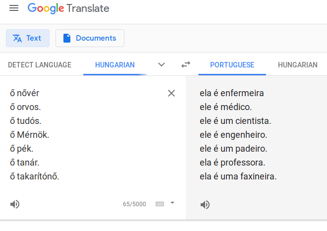
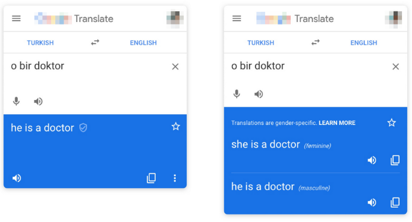

# Investigando Viés de Gênero em Tradução Automática - Um Estudo de Caso com o Google Tradutor

Na última década, as tecnologias digitais têm sido revolucionadas por uma área de estudo da ciência da computação conhecida como "aprendizado de máquina". Em termos simples, aprendizado de máquina consiste na tentativa de produzir sistemas que aprendam a resolver problemas por meio de exemplos. Essa perspectiva vai na contramão da tradição clássica da inteligência artificial, que consiste na descrição explícita (passo-a-passo) da resolução de um problema pelo programador. Obviamente, aprendizado de máquina (ou *deep learning*, em inglês), tem muitas vantagens sobre as técnicas tradicionais, pois nos permite produzir um sistema capaz de resolver problemas *cujo passo-a-passo da resolução eventualmente nós mesmos não entendemos*.

|
:---:
 |
Considere o problema de classificar um número desenhado à mão. É bastante difícil descrever exaustivamente, passo-a-passo, de que maneira analisar os pixels da imagem de modo a obter uma classificação. Mesmo no caso do dígito zero (um dos formatos mais simples), é preciso considerar todas as possíveis irregularidades e variações na tentativa de se desenhar um círculo. No entanto, hoje em dia esse problema pode ser resolvido de maneira muito rápida e simples usando técnicas de aprendizado de máquina. Basta que tenhamos acesso a um conjunto de dados contendo múltiplos exemplos de imagens, anotadas com os números que elas representam, e é possível treinar um sistema para mapear as imagens dos dígitos para as suas repsectivas classes, sem que a regra precise ser programada explicitamente. |

Vários problemas práticos de relevância social e/ou comercial têm sido atacados usando técnicas de aprendizado de máquina nos últimos anos. Um exemplo notório é reconhecimento facial (reconhecer uma pessoa através de uma foto do seu rosto), uma aplicação usada por redes sociais artificiais como o Facebook. Possivelmente o exemplo mais notório de aprendizado de máquina hoje em dia são os próprios mecanismos de busca (ex. Pesquisa Google), que são treinados com dados de usuários para montar um "perfil de busca" para cada usuário e aprender a condicionar os resultados das pesquisas de acordo com o que o usuário já pesquisou no passado. Um treinamento semelhante é adotado por sites de redes sociais (ex. Facebook e Instagram), que são treinados com dados de bilhões de usuários para montar uma linha do tempo com o objetivo de maximizar a atividade ou tempo de uso do usuário na plataforma.

No entanto, recentemente estudiosos não somente da inteligência artificial como de vários outros campos, incluindo as ciências humanas, têm alertado para o fato de que o aprendizado de máquina é uma faca de dois gumes. Ainda que hoje em dia as técnicas de aprendizado de máquina estejam por trás de tecnologias e indústrias que movimentam bilhões de dólares todo ano, a dependência progressiva da nossa sociedade em sistemas treinados via exemplo traz consigo diversos problemas. Um dos problemas mais notórios, de claro impacto social, é o que chamamos *viés de máquina*. Ele se refere ao fenômeno pelo qual sistemas treinados via exemplo acabam herdando vieses presentes nos dados de treinamento. Em 2017, o sistema Google Fotos, que usa reconhecimento facial para organizar de maneira automática a biblioteca pessoal de fotos de cada usuário, foi acusado de classificar pessoas de tom de pele escuro como gorilas. A acusação provocou reações muito fortes, pois uma interpretação ingênua seria de que o sistema foi *explicitamente programado* para classificar pretos e pardos dessa maneira. Um entendimento básico de aprendizado de máquina nos permite entender que esse comportamento na verdade tem relação com o fato de que os engenheiros responsáveis pelo sistema o alimentaram com um conjunto de treinamento enviesado, que provavelmente tinha baixa representação de pessoas pretas ou pardas em proporção a caucasianos. A partir do momento que o sistema não é alimentado com esses exemplos, a sua capacidade de identificar pretos ou pardos como seres humanos se torna limitada, e algum nível de erro é esperado. Deste modo, a questão se torna um pouco mais sutil: em se tratando de aprendizado de máquina, os possíveis preconceitos dos engenheiros por trás do sistema não se manifestam ativamente, mas passivamente. A indiferença com relação à representatividade de todas as etnias no conjunto de treinamento se manifesta de maneira não-antecipada no produto final, com implicações possivelmente traumáticas para os seus usuários. Esse exemplo se soma a um número de outras acusações recentes, como a de um preditor de reincidência criminal que, se sugere, acusa pretos e pardos como tendo maior probabilidade de reincidir num crime, se comparados com caucasianos com as mesmas características; e o sistema de reconhecimento do Iphone X, acusado de não ser capaz de distinguir duas pessoas asiáticas diferentes uma da outra.

Em 2017, algumas capturas de tela viralizaram nas redes sociais sugerindo que o sistema de tradução automática Google Tradutor também exibia viés de máquina, específicamente viés de *gênero*. Na prática, o que se observava era que, quando traduzíamos sentenças de um idioma com suporte para pronomes de gênero neutro (por exemplo, no idioma Húngaro, o pronome "ő" pode ser lido tanto como "ele" quanto como "ela") para um idioma como o português ou o inglês, em que os pronomes têm gênero, o sistema traduzia cada sentença com pronome masculino ou feminino dependendo do contexto. Por exemplo, a sentença em Húngaro "ő nővér" ("ele/ela é enfermeiro(a).") era traduzida como "ela é enfermeira.", enquanto a sentença "ő orvos." ("ele/ela é médico(a)") era traduzida como "ele é médico.". Esse fenômeno curioso levantou acusações de que o sistema exibe viés de gênero, mas é impossível condená-lo ou inocentá-lo a partir de apenas algumas capturas de tela. O que o nosso grupo de pesquisa se propôs a fazer, então, foi selecionar um conjunto de idiomas que admitem pronomes de gênero neutro, coletar uma lista volumosa de 1020 profissões e pedir que o Google Tradutor traduzisse sentenças no formato "ele/ela é um(a) <profissão>" de cada um desses idiomas para o inglês. Isso nos permitiu coletar estatísticas sobre a proporção de vezes que uma sentença era traduzida com pronome feminino, masculino ou neutro (o português não tem pronome neutro, mas o inglês sim: "it") para cada profissão. Além disso, como as profissões podem ser agrupadas em categorias (por exemplo, profissões da área médica, profissões de ciência e tecnologia, etc.), também pudemos calcular estatísticas dentro de cada categoria.

|
:---:
 |
Variações desta captura de tela viralizaram nas redes sociais em 2017. Nele, podemos observar uma sequência de frases escritas no idioma húngaro, que admite pronomes de gênero neutro (no caso, o pronome "ő" pode ser lido tanto como "ele" quanto como "ela") sendo traduzidas para o português, onde os pronomes têm gênero. O fato curioso é que o sistema traduz algumas profissões com gênero feminino e outras com gênero masculino. O fato de "enfermeira", "professora", "faxineira" serem traduzidos com pronome feminino enquanto "médico", "cientista", "engenheiro" serem traduzidos com pronome masculino sugere a existência de algum tipo de viés de gênero. |

A tabela abaixo detalha quais foram os idiomas escolhidos (coluna "Testada") e porquê. De maneira geral, escolhemos idiomas que suportam pronomes de gênero neutro, com algumas exceções nos idiomas persa, nepalês e coreano, que produziram dificuldades técnicas.

Família | Linguagem | Suporta Pronomes de Gênero Neutro? | Testada
--- | --- | --- | ---
Austronésias | Malay | Sim | Sim
Urálicas | Estoniano | Sim | Sim
Urálicas | Finlandês | Sim | Sim
Urálicas | Húngaro | Sim | Sim
Indo-Europeias | Armênio | Sim | Sim
Indo-Europeias | Bengali | Sim | Sim
Indo-Europeias | Persa | Sim | Não
Indo-Europeias | Língua Nepalesa | Sim | Não
Japônicas | Japonês | Sim | Sim
Coreônicas | Coreano | Não | Não
Turcas | Turco | Não | Sim
Níger-Congo | Iorubá | Sim | Sim
Níger-Congo | Suaíli | Sim | Sim
Isoladas | Língua Basca | Sim | Sim
Sino-Tibetanas | Chinês | Sim | Sim

A tabela abaixo detalha quais foram as profissões selecionadas, obtidas do U.S. Bureau of Labor Statistics (Departamento Americano de Estatísticas Laborais) em https://www.bls.gov/cps/cpsaat11.htm. Esses dados dizem respeito ao mercado de trabalho americano. A última coluna ("Participação Feminina") mostra a proporção de trabalhadoras do gênero feminino na respectiva categoria.

Categoria | Grupo | Nº de Ocupações | Participação Feminina
--- | --- | --- | ---
Educação, Treinamento, e Biblioteca | Educação | 22 | 73.0%				
Suporte de Escritório e Administrativo				| Serviços						| 87 				| 72.2%				
Suporte de Saúde 								| Saúde					| 16 				| 87.1%				
Gestão 										| Corporativo						| 46 				| 39.8%				
Instalação, Manutenção e Reparo 			| Serviços						| 91 				| 4.0% 				
Profissionais e Técnicos de Saúde 			| Saúde					| 43 				| 75.0%				
Serviço Comunitário e Social 					| Serviços						| 14 				| 66.1%				
Vendas e Similares 								| Corporativo						| 28 				| 49.1%				
Produção 										| Produção					| 264 			| 28.9%				
Arquitetura e Engenharia 					| Ciência, Tecnologia, Engenharia e Matemática 							| 29 				| 16.2%				
Ciências da Saúde, Físicas e Sociais				| Ciência, Tecnologia, Engenharia e Matemática 							| 34 				| 47.4%				
Transporte				| Serviços						| 70 				| 17.3%				
Artes, Design, Entretenimento, Esportes e Mídia | Artes / Entretenimento 			| 37 				| 46.9%				
Jurídico											| Jurídico 						| 7				| 52.8%				
Serviços de Proteção 								| Serviços 						| 28 				| 22.3%				
Preparo de alimentos e relacionados 			| Serviços 						| 17 				| 53.8%				
Agricultura, Pesca e Silvicultura 					| Agricultura / Pesca / Silvicultura 	| 13 				| 23.4%				
Computação e Matemática						| Ciência, Tecnologia, Engenharia e Matemática 							| 16 				| 25.5%				
Cuidados Pessoais						| Serviços 						| 33 				| 76.1%				
Construção e Extração 					| Construção / Extração 	| 68 				| 3.0% 				
Limpeza e Manutenção de Edifícios e Terrenos 	| Serviços 						| 10 				| 40.7%				 
Total											| - 							| 1019			| 41.3%				

Na tabela abaixo, um resumo dos resultados obtidos. Para cada categoria de trabalho, podemos comparar a proporção de sentenças traduzidas com pronome feminino, masculino ou neutro. De maneira geral, o sistema traduz usando pronomes masculinos com muito maior frequência. Também Podemos observar que em categorias estereotípicas masculinas, como Ciência, Tecnologia, Engenharia e Matemática, a proporção de traduções femininas diminui enquanto a de traduções masculinas cresce.

Category | Feminino (%) | Masculino (%) | Neutro (%)
---|---|---|---
Serviço | 10.5 | 59.548 | 16.476 
Ciência, Tecnologia, Engenharia e Matemática | 4.219 | 71.624 | 11.181 
Agricultura, Pesca e Silvicultura | 12.179 | 62.179 | 14.744 
Corporativo | 9.167 | 66.042 | 14.861 
Saúde | 23.305 | 49.576 | 15.537 
Jurídico | 11.905 | 72.619 | 10.714 
Arte / Entretenimento | 10.36 | 67.342 | 11.486 
Educação | 23.485 | 53.03 | 9.091 
Produção | 14.331 | 51.199 | 18.245 
Construção / Extração | 8.578 | 61.887 | 17.525
Total | 11.76 | 58.93 | 15.939 

Os resultados nos levam a crer que o Google Tradutor (que é treinado também a partir dos feedbacks dos usuários) incorporou viés de gênero dos dados de treinamento. Existe a possibilidade, ainda, que o Google Tradutor esteja apenas refletindo a proporção de participação feminina em cada categoria. Por exemplo, talvez o sistema traduza com pronome feminino sentenças sobre vagas na saúde com 23% porque a categoria de saúde é composta (aproximadamente) de 23% de trabalhadoras mulheres. Conduzimos testes estatísticos para verificar essa possibilidade, no entanto, e ela não se sustenta. Em quase todos os casos, a participação feminina numa vaga de trabalho é maior do que a probabilidade do Google Tradutor traduzir uma sentença sobre aquela profissão usando o pronome feminino. Ou seja: aparentemente, o viés de gênero do sistema vai além da assimetria no mercado de trabalho. Possivelmente ele reflete os estereótipos associados às profissões. Por exemplo, ainda que vagas em Ciência, Tecnologia, Engenharia e Matemática sejam estereotipicamente consideradas masculinas (e traduzidas como feminino somente 4% das vezes), a participação feminina é de 31%.

|
:---:
 |
Comparação entre uma captura de tela do Google Tradutor antes (à esquerda) e depois (à direita) da atualização que oferece traduções em ambos os gêneros, para algumas linguagens. |

Nosso estudo foi publicado inicialmente em Setembro de 2018. Desde então, a Google tem tomado providências para mitigar o efeito do viés no sistema, por exemplo oferecendo traduções em ambos os gêneros masculino e feminino. Como pesquisadores, reconhecemos que o viés de gênero presente no Google Tradutor é acidental e não proposital. Além disso, reconhecemos que não é prático selecionar conjuntos de treinamento sem viés para treinar esse tipo de sistema, pois eles provavelmente não existem. No entanto, existem técnicas simples e eficientes que são capazes de remover viés de um sistema treinado. Nosso objetivo é o de que o nosso trabalho possa servir de alerta sobre os perigos que o viés de máquina representa, e de convite para que as empresas que fazem uso aprendizado de máquina se esforcem para remover ativamente o viés dos seus sistemas treinados.